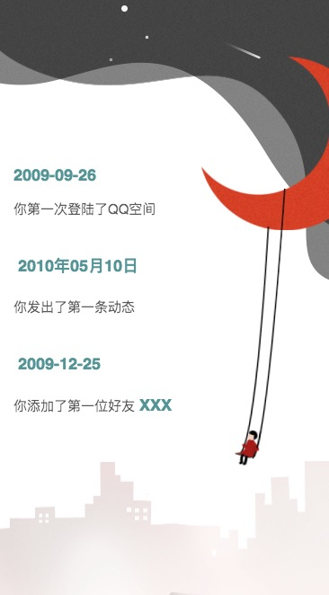

<h1 align="center">Welcome to QQZoneSwipper 👋</h1>
<p>
  
  <a href="https://github.com/Maicius/QQZoneSwipper/blob/master/LICENSE" target="_blank">
    
  </a>
</p>

[中文文档](https://github.com/Maicius/QQZoneSwipper/blob/master/README.md) | English Documentation

---

> Qzone data analysis display page imitating NetEase Music annual report style, modularisation done using React. 

### 🏠 [Homepage](https://github.com/Maicius/QQZoneSwipper)

### ✨ [Demo](http://qq.xiaomaidong.com/)

---

## 📥 Install

```sh
git clone https://github.com/Maicius/QQZoneSwipper.git
```

## 📤 Deploy

just run deploy.sh (enter`./deploy.sh` into command line) or enter the two commands below into shell: 

```sh
> npm install --save
> npm run start
```

---

## Screenshots





---

## 👥 Authors

👤 **Maicius**

* Website: http://www.xiaomaidong.com
* Github: [@Maicius](https://github.com/Maicius)

## 🤝 Contributing

Any contribution is appreciated! Contributions, issues and feature requests are welcomed!<br />Feel free to check [issues page](https://github.com/Maicius/QQZoneSwipper/issues). 

## 👍 Show your support

Give a ⭐️ if this project helped you! 

## 📝 License

Copyright © 2020 [Maicius](https://github.com/Maicius).<br/>
This project is [MIT](https://github.com/Maicius/QQZoneSwipper/blob/master/LICENSE) licensed.

