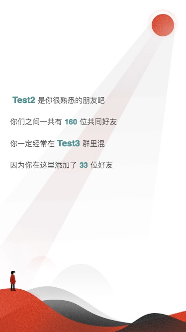

<h1 align="center">Welcome to QQZoneSwipper 👋</h1>
<p>
  
  <a href="https://github.com/Maicius/QQZoneSwipper/blob/master/LICENSE" target="_blank">
    
  </a>
</p>

中文文档 | [English Documentation](https://github.com/Maicius/QQZoneSwipper/blob/master/README-en.md)

---

> 模仿网易云年度报告风格的QQ空间数据分析展示页面，使用React做了模块化

### 🏠 [主页](https://github.com/Maicius/QQZoneSwipper)

### ✨ [演示](http://qq.xiaomaidong.com/)

---

## 📥 安装

```sh
git clone https://github.com/Maicius/QQZoneSwipper.git
```

## 📤 部署

运行 deploy.sh (在命令行中输入 `./deploy.sh`) 或者将如下两个命令输入命令行: 

```sh
> npm install --save
> npm run start
```

---

## 截图





---

## 👥 作者

👤 **Maicius**

* 网站: http://www.xiaomaidong.com
* Github: [@Maicius](https://github.com/Maicius)

## 🤝 贡献

任何贡献都是被感谢的！贡献、issues 以及功能提议都是极受欢迎的！

欢迎查看 [issues 页面](https://github.com/Maicius/QQZoneSwipper/issues). 

## 👍 展示支持

如果这个项目对你有帮助，就给个 ⭐️ 吧！

## 📝 授权条款

版权所有 © 2020 [Maicius](https://github.com/Maicius).<br/>这个项目的授权条款是 [MIT](https://github.com/Maicius/QQZoneSwipper/blob/master/LICENSE)。

